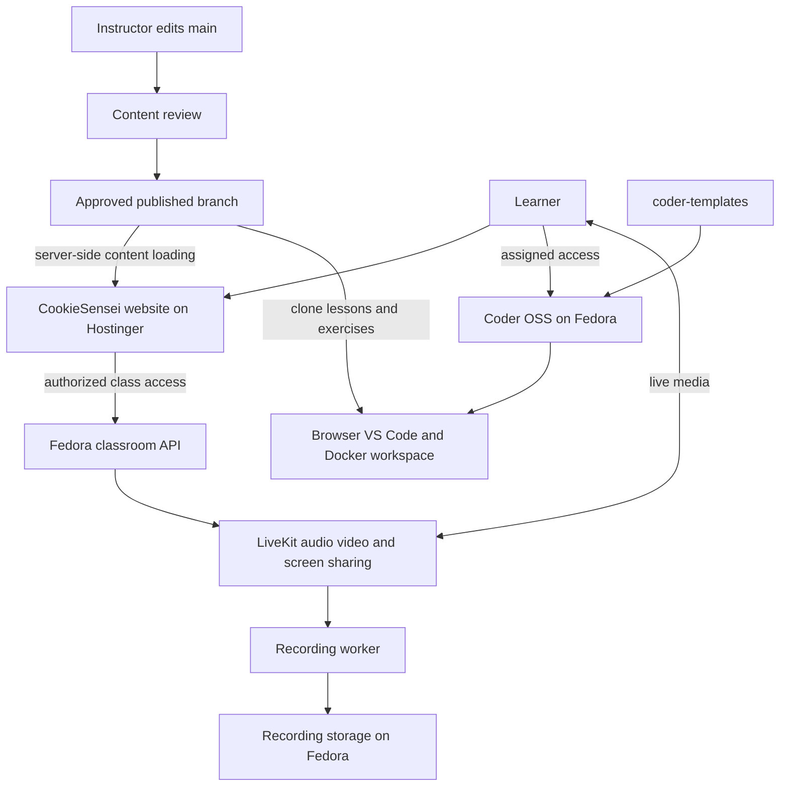

# Programming & AI — CookieSensei

The main learning program for [cookiesensei.com](https://cookiesensei.com), taking beginners from programming foundations to Python, data analysis, machine learning, web applications and a working software product.

This repository is the **syllabus and teaching material**: lessons, Jupyter notebooks, Python examples, datasets and independent practice projects. The Docker images that provide CookieSensei Cloud Labs live in a separate repository.

**Start learning:** [CookieSensei learning library](https://cookiesensei.com/learn) · [Curriculum roadmap](https://cookiesensei.com/curriculum) · [Published source](https://github.com/cookieSensei/programming-and-ai/tree/published)

## Start here

1. Read the first foundation lesson, [What is code?](Phase-0%3EFoundation/1-what-is-code.ipynb).
2. Continue through the phases in order. Read the explanation, run the example, change something small, and explain what changed.
3. Use the published website for reading, GitHub for source, and a Python/notebook environment or an assigned Cloud Lab for execution.
4. In Phases 4 and 5, follow each project's own setup instructions. The projects are independent applications.

The public learning material can be read without a paid enrollment. Managed Cloud Lab and live classroom access are separate services associated with the relevant CookieSensei offering; reading this repository does not create a lab account or classroom invitation.

## Learning path

The authoritative phase paths/order are in [`course.json`](course.json). Preserve their exact names when maintaining content.

| Phase | Material | What you practice |
| --- | --- | --- |
| 0 — [Foundation](Phase-0%3EFoundation/) | What code is, terminal commands, Git and GitHub | Running code and understanding the tools |
| 1 — [Thinking Like a Programmer](Phase-1%3EThinking-Like-A-Programmer/) | Python basics, data structures, functions, loops, classes, NumPy, Pandas and plotting | Reasoning with programs and exploring data |
| 2 — [Building Software](Phase-2%3EBuilding-Softwares/) | Regular expressions, embeddings, Beautiful Soup, chatbot examples and Streamlit | Combining useful software building blocks |
| 3 — [Teaching Computers to Learn](Phase-3%3ETeaching-Computers-To-Learn/) | Regression, classification, clustering, deep learning, computer vision and NLP | Training, evaluating and using models |
| 4 — [Build Web Applications](Phase-4%3EBuild-Web-Applications/README.md) | Django, HTML/CSS, forms, JavaScript, CRUD and a mini product | Building interfaces and interactive applications |
| 5 — [Make Applications Real](Phase-5%3EMake-Applications-Real/README.md) | Databases, SQL, users/authentication, production settings, deployment and a minimum working product | Turning a learning project into something another person can use |

Additional resources:

- [`datasets/`](datasets/): shared CSV/TSV datasets used in exercises.
- [Phase 4–5 student guide](phase-4-5-student-guide.pdf): companion reference.
- [`PUBLISHING.md`](PUBLISHING.md): how approved content reaches the website.

## Get a local copy

### Linux, macOS or a Linux Cloud Lab

```bash
git clone https://github.com/cookieSensei/programming-and-ai.git
cd programming-and-ai
```

This checks out `main`, the authoring branch. To follow the learner-facing revision:

```bash
git fetch origin published
git switch --track origin/published
```

If you already have a local `published` branch, use `git switch published`. Contributors should work from `main` on their own branch.

### Windows

Phase directory names contain **`>`**, which is not valid in native Windows filenames. A normal Git checkout or ZIP extraction onto a Windows filesystem can fail.

Use the website, an assigned Linux Cloud Lab, or WSL. For WSL, clone inside its Linux home (for example `~/projects`), **not under `/mnt/c`**. Quote paths containing `>` in shell commands because the shell otherwise treats it as redirection.

Do not rename phase folders locally as an onboarding workaround: their paths are part of the publishing manifest and lesson/resource links.

## Run notebooks and Python examples

### Option A: CookieSensei AI Cloud Lab

If you have an assigned AI lab, open it from [code.cookiesensei.com](https://code.cookiesensei.com), launch VS Code and clone this repository under the workspace's persistent home directory, usually `/home/coder/project`.

The AI lab image provides these environments; other template types may not:

| Environment | Activate in a terminal | Notebook kernel |
| --- | --- | --- |
| Data science | `source /opt/envs/ds/bin/activate` | Python (Data Science) |
| PyTorch | `source /opt/envs/torch/bin/activate` | Python (PyTorch) |
| TensorFlow | `source /opt/envs/tf/bin/activate` | Python (TensorFlow) |
| OCR / résumé experiments | `source /opt/envs/ats/bin/activate` | Python (ATS Resume AI) |

Use the environment appropriate to the lesson. Terminal activation does not automatically select a notebook's kernel: choose the matching kernel in VS Code/Jupyter too.

```bash
source /opt/envs/ds/bin/activate
python -c "import pandas, sklearn; print('Environment ready')"
```

You can call an interpreter directly, for example `/opt/envs/torch/bin/python your_script.py`. GPU visibility and framework compatibility depend on the assigned workspace; introductory programming/data lessons do not require a GPU.

Keep work under the persistent home directory and push your own projects to Git. A container's `/workspace` directory is not automatically a persistent Coder volume.

### Option B: Your own Python environment

Use a Python version supported by the lesson's dependencies. The Django practice projects use Django 5.2; Python 3.10 or newer is required for that framework. Individual AI lessons may need different framework/Python combinations.

The repository has **no universal root `requirements.txt` or `setup.sh`**. This is a starting environment for basic notebooks, not a promise that every AI example uses the same dependencies:

```bash
python3 -m venv .venv
source .venv/bin/activate
python -m pip install --upgrade pip
python -m pip install jupyterlab ipykernel numpy pandas matplotlib seaborn scikit-learn
python -m ipykernel install --user --name cookiesensei-study --display-name "Python (CookieSensei study)"
jupyter lab
```

Open the lesson notebook and choose **Python (CookieSensei study)**. Install extra libraries only as required by the lesson, in a suitable environment. Some examples need downloaded datasets, model files or service credentials beyond what is committed; inspect their imports and paths first.

Dataset paths can be relative to the notebook's working directory. If a file cannot be found, locate it in `datasets/` or the lesson's resources and adjust the example path deliberately.

### Streamlit examples

In an environment containing Streamlit, run a selected lesson's app:

```bash
streamlit run app.py --server.address 0.0.0.0 --server.port 8501
```

Open localhost port 8501 for local work, or the authenticated Coder forwarded port in a lab. Keep CORS/XSRF protections enabled; diagnose URL/proxy configuration if an upload fails instead of disabling them as a routine workaround.

## Run the web application projects

Phase 4 contains independent Django projects plus a plain JavaScript project. Example, from the repository root in a Linux/macOS shell:

```bash
cd "Phase-4>Build-Web-Applications/projects/01-my-first-django-website"
python3 -m venv .venv
source .venv/bin/activate
python -m pip install -r requirements.txt
python manage.py migrate
python manage.py runserver
```

Open `http://127.0.0.1:8000`. In a remote lab, use `python manage.py runserver 0.0.0.0:8000` and Coder's authenticated port forwarding; configure the project's allowed host for that preview hostname as needed. Django's development server is for exercises, not public production hosting.

Phase 4's JavaScript project needs no Python environment. Phase 5 introduces database/authentication/deployment concepts; read the [Phase 5 guide](Phase-5%3EMake-Applications-Real/README.md) and the selected project's README and environment example. Its production-style projects need settings beyond simply running the development server.

## How the complete CookieSensei system works

| Repository | Responsibility |
| --- | --- |
| **programming-and-ai** | What students learn: content, examples, manifest and publishing rules |
| [cookiecloudlabs](https://github.com/cookieSensei/cookiecloudlabs) | Website/LMS integration, enrollment, payments, student/admin access and classroom interface |
| [coder-templates](https://github.com/cookieSensei/coder-templates) | Reusable Docker environments and Terraform definitions for Cloud Labs |
| [threadripper_fedora_services_virtual_classroom](https://github.com/cookieSensei/threadripper_fedora_services_virtual_classroom) | Fedora setup and self-hosted classroom API, LiveKit and recordings |

Some companion repositories are private and require collaborator access.



### Hostinger: website delivery

The website repository's deployment notes describe an **Ubuntu Hostinger VPS** running Next.js through **PM2**, with **Nginx/HTTPS** in front. Operators pull an approved website revision, install dependencies, apply required database migrations, build Next.js and restart the PM2 process. Website code deployment is separate from publishing this curriculum.

The live learning platform's contract is to load approved syllabus content **server-side**, resolve `published` to a commit SHA, and serve lessons/resources under CookieSensei URLs. Students do not need a GitHub token. The website default branch may differ from its deployed branch; the website README calls out that distinction.

### Fedora: labs and live classes

The Threadripper runs Fedora, Docker, Coder OSS and its separate database. Coder is exposed through a Cloudflare Tunnel and creates lab containers from `coder-templates`, with persistent home volumes and optional GPU access. Learners read a lesson, open their workspace, clone the exercises and run them with the appropriate environment.

The same machine hosts the separate Fastify classroom API, classroom PostgreSQL, LiveKit, Redis and Egress recording worker. The website calls the classroom API over private connectivity; browsers join LiveKit media sessions with scoped tokens. Recordings remain runtime files, not syllabus/Git content.

Maintainers can find the detailed [Fedora/Coder/LiveKit setup](https://github.com/cookieSensei/threadripper_fedora_services_virtual_classroom#readme) and [Hostinger deployment](https://github.com/cookieSensei/cookiecloudlabs#hostinger-vps-deployment) in the companion guides. Their configuration does not need to be installed just to study a notebook.

## Contribute and publish lessons

1. Branch from `main` and edit the appropriate phase. Preserve the exact phase path and stable lesson/resource links.
2. Follow the existing numbered filename conventions; ordering is derived naturally from filenames/directories.
3. Run changed notebook cells or the affected project in a fresh, appropriate environment. Verify relative resource paths and remove private data, credentials and accidental sensitive outputs.
4. Keep reusable datasets under `datasets/` or the relevant lesson resources, and update `course.json` only when the content structure changes.
5. Review changes, then publish through the authenticated CookieSensei admin workflow described in [`PUBLISHING.md`](PUBLISHING.md).

`main` is the **authoring** branch; `published` is the **learner-facing** branch. Publishing fast-forwards `published` to an approved `main` commit. A commit to `main` does not automatically publish a website lesson. This repository is public, so “draft” means not yet selected for the learning website, not private.

The manifest recognizes `.md` and `.ipynb` lessons, lists permitted resource extensions, declares `datasets` as a public resource root, and excludes the root README/`note.txt`/`.gitignore` from course content. There is no root application build or universal test command; validate the material you change.

## Common problems

| Problem | What to check |
| --- | --- |
| Windows clone says invalid path | Use a Linux filesystem/WSL home or Cloud Lab; phase names contain `>` |
| Shell command behaves strangely with a phase path | Quote the complete path |
| Import works in terminal but not notebook | Notebook kernel uses a different interpreter |
| Missing dataset/model | Working directory, lesson resource instructions and file paths |
| No GPU / CUDA error | Assigned template, selected environment and compatible framework; use CPU where the lesson allows |
| Web project cannot find Django | Activate that project's environment and install its own requirements |
| Port opens locally but not in a lab | Bind to the appropriate interface, forward the port and allow the preview hostname |
| Edits are absent from the learning website | Confirm the approved `published` revision and publishing workflow |

## License and attribution

The repository's existing README declared **MIT License**; a standalone `LICENSE` file is not currently included. This documentation update preserves that declaration rather than introducing new license terms. Credit CookieSensei and link back to this repository when sharing material; consult the [published reuse guidance](https://cookiesensei.com/learn) for the program's attribution information.
